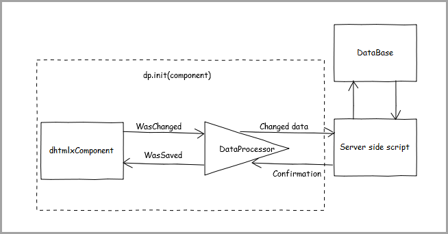
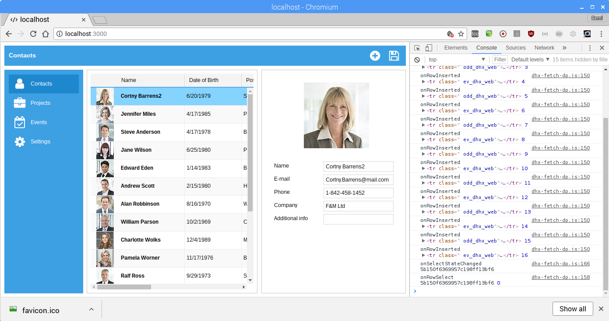
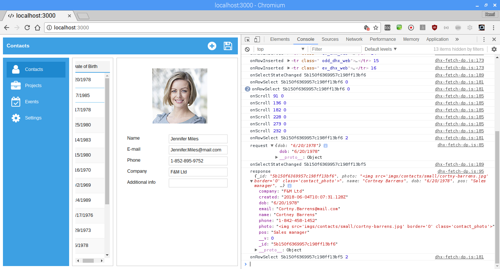
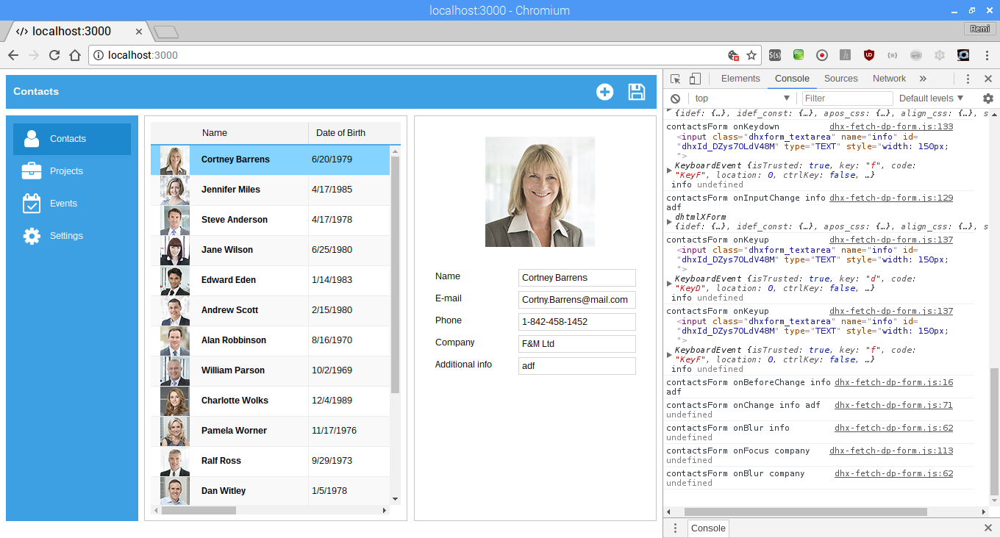
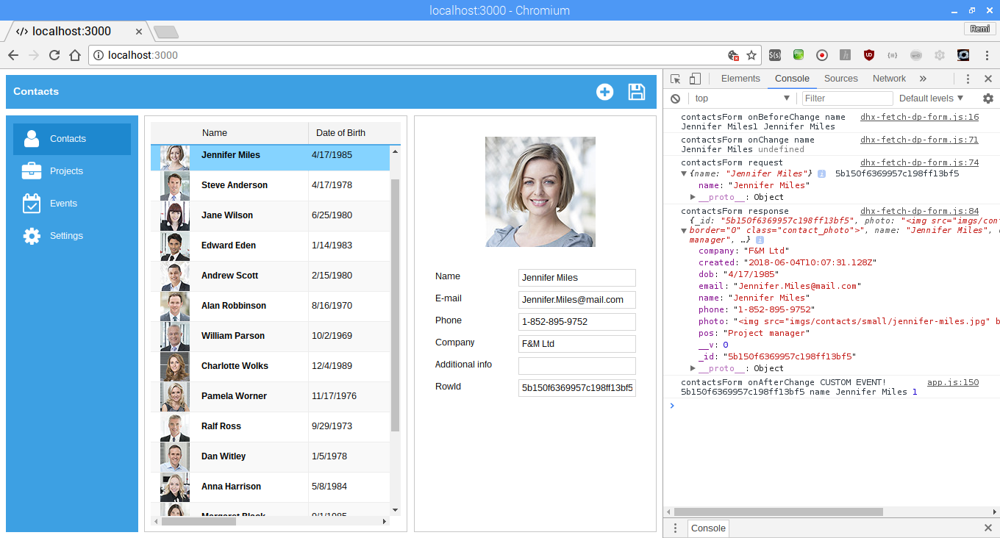

# dhtmlx-json-node

This is a short tutorial to set up dhtmlx (dhx) using only JSON and node/mongodb as a back-end and the REST API. Recently I followed the ['Your First App'](https://docs.dhtmlx.com/tutorials__first_app__index.html) tutorial and felt unsatisfied with what I've learned. So I decided to push a little harder and use a demo app ['CRM System'](https://dhtmlx.com/docs/products/demoApps/dhtmlxCRMSystem/index.html) as the base and create my own tutorial.

## Prerequisites:

1. latest node and npm
2. mongodb server up and running
3. up-to-date javascript, git, bash and mongodb skills

You could have a look at setting up such an environment on either a [physical raspberry pi](https://www.linkedin.com/pulse/develop-full-stack-javascript-applications-using-only-remi-kristelijn/) or a [virtual raspberry pi](https://www.linkedin.com/pulse/my-perfect-javascript-developer-set-up-remi-kristelijn/).

In this tutorial I consider: less is more, if we can use defaults, we should do it (default: index.html, index.js etc). Only use stuff if and when we need it. I try to follow the latest standards, like lambda's, HTML5, WCAG, OWASP, etc. Also I try to teach only once: the right way. I think it is better to learn things the right way and later discover; 'hey... there is also a old or wrong way'. 

This tutorial follows my development step by step using git branches. Every chapter contains a link to the feature branch.

# Plan
  - [x] [Step1: Create static html page in Node](#step-1-static-node-web-server)
  - [x] [Step2: Get dhx up and running](#step-2-get-dhx-up-and-running)
  - [x] [Step3: Initialize the layout, grid and form with static data](#step-3-initialize-the-layout-grid-and-form-with-static-data)
    - [ ] Step3a: Improve code
      - [x] [Step3a1: Fix xml to json](#step-3-a-change-xml-to-json)
      - [ ] Step3ax: Remove statics from code
    - [ ] Remove globals
    - [ ] Use streamable technology (fetch?)
    - [ ] Write some tests
  - [ ] [Step4: Create and connect REST API](#step-4-create-and-connect-rest-api)
    - [x] GET using statics for [contacts](#step-4-create-and-connect-rest-api), [projects](#step-4b-set-up-get-for-projects-with-a-static-file), [events and settings](#step-4c-events-and-settings).
    - [x] [GET using data from db](#step-4d-get-using-data-from-db)
    - [ ] [PUT for updates](#step-4e-put-for-updates)
    - [ ] POST for create
    - [ ] DELETE for delete

  - [References](#references)

# Step 1: Static node web server

[back to top](#plan)

[@see branch step 2](https://github.com/rkristelijn/dhtmlx-json-node/tree/step1)

Use npm to create a new `package.json` file:

`npm init`
- package name: (default)
- version: 0.0.1
- description: Basic application using dhtmlx, json, node, rest
- entry point: index.js
- test command: (empty)
- git repo: (default)
- keywords: dhtmlx, json, node, rest
- author: Remi Kristelijn
- licence: (default: ISC)
- Ok?: yes

Before we start coding, we need express as our middleware.

`npm i --save express`

This created the node_modules folder that we need to add to the .gitignore file:

`echo node_modules > .gitignore`

Then we create the entry point `index.js`

```javascript
const express = require('express');
const app = express();

app.get('/', (req, res) => {
  res.send("<h1>Hello World</h1>");
});

app.listen(3000, () => {
  console.log('listening on *:3000');
});
```
That is all you need to create a simple node app. You can either use `node .` to fire up your application and point your browser to `http://localhost:3000`

Let's save our work using `git add.`, `git commit -a -m "blablabla"` and `git push`

# Step 2: Get dhx up and running

[back to top](#plan)

[@see branch step 2](https://github.com/rkristelijn/dhtmlx-json-node/tree/step2))

Instead of sending a string, we will send a static html page.

A few notes; 
- as of August 2016 [dhx provides a CDN](https://dhtmlx.com/blog/support-updates-dhtmlx-cdn-new-snippet-tool/) so we don't have to download the javascript files.
- WCAG dictates a page should have a language

Create `index.html`:
```html
<!DOCTYPE html>
<html lang="en">

<head>
  <link rel="stylesheet" type="text/css" href="//cdn.dhtmlx.com/edge/dhtmlx.css">
  <script src="//cdn.dhtmlx.com/edge/dhtmlx.js"></script>
</head>

<body>
  <script type="text/javascript">
    dhtmlxEvent(window, "load", function () {
      dhtmlx.message({ type: "alert", text: "Hello world" });
    });
  </script>
</body>

</html>
```

Update `index.js`:
```javascript
const express = require('express');
const app = express();

app.get('/', (req, res) => {
  // step2: instead of sending a string, we send a file
  res.sendFile(__dirname + '/index.html');
});

app.listen(3000, () => {
  console.log('listening on *:3000');
});
```
Restart your node application and enjoy the majesty.


# Step 3: Initialize the layout, grid and form with static data

[back to top](#plan)

[@see branch step 3](https://github.com/rkristelijn/dhtmlx-json-node/tree/step3))

Best practices is to not mix html, javascript, css, etc together, so in this case, we are writing our dhtmlx app inline of index.html. Let's fix that. Before we do that, we need to create folder that is able to load our static files. We call this folder `public`.

- `mkdir public`
- `mv index.html public`

Update `index.js`

```javascript
const express = require('express');
const app = express();
const path = require('path'); // step 3: we need to add path in order to use it

app.use('/', express.static(path.join(__dirname, 'public'))); // step 3: just serve up the full public directory

app.listen(3000, () => {
  console.log('listening on *:3000');
});
```
- type `node .` just to make sure we didn't break anything.


Now it is time to extract the javascript from `index.html`.

```html
<!DOCTYPE html>
<html lang="en">

<head>
  <link rel="stylesheet" type="text/css" href="//cdn.dhtmlx.com/edge/dhtmlx.css">
  <script src="//cdn.dhtmlx.com/edge/dhtmlx.js"></script>
</head>

<body>
  <script type="text/javascript" src="app.js"></script>
</body>

</html>
```

Create a new file `public/app.js`

```javascript
dhtmlxEvent(window, "load", function () {
  dhtmlx.message({ type: "alert", text: "Hello world" });
});
```

Save and restart the server


Isn't that sweet.

Before we continue we probably are tired of restarting the server. Let's fix that using nodemon.

`npm i --save-dev nodemon`

We don't need to install globally as we can access the nodemon executables from the npm script.

Update `package.json`, add a `start`-script and add an ignore for the public folder:

```json
{
  "//<!--...":"...-->",

  "scripts": {
    "start": "nodemon ./index.js --ignore public/",
    "test": "echo \"Error: no test specified\" && exit 1"
  },

  "//<!--...":"...-->",

  "dependencies": {
    "express": "^4.16.3"
  },
  "devDependencies": {
    "nodemon": "^1.17.5"
  }
}
```
Now we are going to create the sidebar and the menu. It seems the demo app ['CRM System'](https://dhtmlx.com/docs/products/demoApps/dhtmlxCRMSystem/index.html) uses a different skin.

Update `index.html`:

```html
<!DOCTYPE html>
<html lang="en">

<head>
  <link rel="stylesheet" type="text/css" href="//cdn.dhtmlx.com/edge/skins/web/dhtmlx.css">
  <script src="//cdn.dhtmlx.com/edge/dhtmlx.js"></script>
  <link rel="stylesheet" type="text/css" href="style.css">
</head>

<body>
  <script type="text/javascript" src="app.js"></script>
</body>

</html>
```

Also create `public/style.css`
```css
html, body {
	width: 100%;
	height: 100%;
	margin: 0px;
	overflow: hidden;
}
```

Then we need to create all elements, update `public/app.js`

```javascript
var mainSidebar;
var mainToolbar;

function appInit() {
  mainSidebar = new dhtmlXSideBar({
    parent: document.body,
    icons_path: "imgs/sidebar/",
    width: 180,
    template: "tiles",
    items: [
      { id: "contacts", text: "Contacts", icon: "contacts.png" },
      { id: "projects", text: "Projects", icon: "projects.png" },
      { id: "events", text: "Events", icon: "events.png" },
      { id: "settings", text: "Settings", icon: "settings.png" }
    ]
  });

  mainToolbar = mainSidebar.attachToolbar({
    icons_size: 32,
    icons_path: "imgs/toolbar/",
    items: [
      { type: "text", id: "title", text: "&nbsp;" },
      { type: "spacer" },
      { type: "button", id: "add", img: "add.png" },
      { type: "button", id: "save", img: "save.png" }
    ]
  });

  mainSidebar.attachEvent("onSelect", function (id) {
    // todo, below doesn't look right; HTML in javascript
    mainToolbar.setItemText("title", window.dhx4.template("<span style='font-weight: bold; font-size: 14px;'>#text#</span>", { text: mainSidebar.cells(id).getText().text }));
  });

  // select 'Contacts' by default
  mainSidebar.cells("contacts").setActive(true);
}

dhtmlxEvent(window, "load", appInit);

```

Refresh and this is what we get:


Now the demo uses different js files for the 4 options in the menu and this is initialized on start. We combine the file to improve performance to have only one js file downloaded. Also the demo uses Google maps, we just ignore this feature for now as we need API keys in order for it to work. Also we need tons of images, data files etc. We combine this into one app. Next to that we need to remove the loader from the codebase.

The application looks now like this, and no console errors.


## Step 3 a: Change XML to JSON

[back to top](#plan)

[@see branch Step3a1](https://github.com/rkristelijn/dhtmlx-json-node/tree/Step3a1)

JSON is much more lightweight than XML. 

```bash
pi@raspberry:~/dhtmlx-json-node/public/server $ ls -al
4364 contacts-minified.json
4445 contacts-ndjson.json
5639 contacts-minified.xml
6475 contacts-fully-beautified.json
6588 contacts-fully-beautified.xml
```

I'm only drawing conclusions on the minified versions, this is an improvement of (5639-4364) is 1275 bytes less (23% smaller). Let alone having to encode binary data using base64. It is the same for JSON, however there is [BSON](http://bsonspec.org)

Steps to convert dhx XML to JSON:

1. use [XML to JSON](http://www.utilities-online.info/xmltojson/) to convert data
2. replace `"-width"` with `"width"`, same for `id`, `type`, `align`, `sort` -> by replacing `"-` for `"`
3. replace `"#text"` with `"value"`
4. repoace `"cell"` with `"data"`
4. replace `"#cdata-section"` with `"value"`
5. remove `rows` level on top, remove `colums` level in head, rename `row` to `rows` below the header

Now we need to update the function calls to 'eat' JSON instead of XML. The weird thing is that every dhx object seems to need a different structure.

## Old Code:

```javascript
// ... CONTACTS
contactsGrid.load(A.server + "contacts.xml?type=" + A.deviceType, function () {
  contactsGrid.selectRow(0, true);
});
// ... PROJECTS
projectsGrid.load(A.server + "projects.xml?type=" + A.deviceType, function () {
  projectsGrid.selectRow(0, true);
});
// ... EVENTS
eventsDataView.load(A.server + "events.xml?type=" + A.deviceType);

// ... SETTINGS
settingsDataView.load(A.server + "settings.xml?type=" + A.deviceType, function () {
  settingsDataView.select("contacts");
});
```

## New Code:
```javascript
// ... CONTACTS
contactsGrid.load(A.server + "contacts.json?type=" + A.deviceType, function () {
  contactsGrid.selectRow(0, true);
}, "json");

// ... PROJECTS
projectsGrid.load(A.server + "projects.json?type=" + A.deviceType, function () {
  projectsGrid.selectRow(0, true);
}, "json");

// ... EVENS
eventsDataView.load(A.server + "events.json?type=" + A.deviceType, "json");

// ... SETTINGS
// load the data, somehow a callback doesn't work
settingsDataView.load(A.server + "settings.json", "json");
// fires when the data loading is finished and a component or data is rendered
settingsDataView.attachEvent("onXLE", function () {
  settingsDataView.select("contacts");
});
```

# Step 4: Create and connect REST API

[back to top](#plan)

[@see branch Step4](https://github.com/rkristelijn/dhtmlx-json-node/tree/Step4)

## Step 4a: set up GET for contacts with a static file

The first thing we need to do is create a router set for every element.

`index.js`
```javascript
const express = require('express');
const app = express();
const path = require('path');

const port = 3000;

app.use('/', express.static(path.join(__dirname, 'public')));

/// /* step 4
const apiRouter = require('./api/api-router')();
app.use('/api', apiRouter);
/// step 4 */

app.listen(port, () => {
  console.log('listening on *:' + port);
});
```

Then we create a new file and put some [HATEOAS](https://spring.io/understanding/HATEOAS) in.

`api\api-router.js`
```javascript
const express = require('express');

let routes = () => {
  let apiRouter = express.Router();

  apiRouter.get('/', (req, res) => {
    res.json({
      contacts: { links: `${req.protocol}://${req.headers.host}/api/contacts` }
    });
  });

  return apiRouter;
}

module.exports = routes;
```

Now we have this:


I use [JSON viewer](https://github.com/tulios/json-viewer) to beautify.

Then we add an API for the contacts. Therefore we need to 
- move `/public/server/contacts.json` to `/api/contacts/contacts.json`

Add `api/contact/contacts-router.js`

```javascript
const express = require('express');

let routes = () => {
  let contactsRouter = express.Router();

  contactsRouter.get('/', (req, res) => {
    res.sendFile(__dirname + '/contacts.json');
  });

  return contactsRouter;
}

module.exports = routes;
```
And update `/api/api-router.js`

```javascript
const express = require('express');
const contactsRouter = require('./contacts/contacts-router')(); // add this line

let routes = () => {
  let apiRouter = express.Router();

  apiRouter.use('/contacts', contactsRouter); // add this line

  apiRouter.get('/', (req, res) => {
    res.json({
      contacts: { links: `${req.protocol}://${req.headers.host}/api/contacts` }
    });
  });

  return apiRouter;
}

module.exports = routes;
```
Finally we need tell the front-end that the entrypoint for getting contacts is moved.

`public/app.js`

```javascript
contactsGrid.load("api/contacts?type=" + A.deviceType, function () {
  contactsGrid.selectRow(0, true);
}, "json");
```
The result:


## Step 4b: set up GET for projects with a static file

[back to top](#plan)

Same as for contacts;

- we create a folder in `api` called `projects`, 
- move the file `public/server/projects.json` to `api/projects`
- create a new file `api/projects/projects-router.js`
- add the route to `api/api-router.js`
- point the load event to `/api/projects`

`api/projects/projects-router.js`

```javascript
const express = require('express');

let routes = () => {
  let projectsRouter = express.Router();

  projectsRouter.get('/', (req, res) => {
    res.sendFile(__dirname + '/projects.json');
  });

  return projectsRouter;
}

module.exports = routes;
```

`api/api-router.js`

```javascript
const express = require('express');
const contactsRouter = require('./contacts/contacts-router')();
const projectsRouter = require('./projects/projects-router')(); // add this line

let routes = () => {
  let apiRouter = express.Router();

  apiRouter.use('/contacts', contactsRouter);
  apiRouter.use('/projects', projectsRouter); // add this line

  apiRouter.get('/', (req, res) => {
    res.json({
      contacts: { links: `${req.protocol}://${req.headers.host}/api/contacts` },
      projects: { links: `${req.protocol}://${req.headers.host}/api/projects` }  // add this line
    });
  });

  return apiRouter;
}

module.exports = routes;
```

`public/app.js`

```javascript
projectsGrid.load("api/projects?type=" + A.deviceType, function () {
  projectsGrid.selectRow(0, true);
}, "json");
```
## Step 4c: events and settings

[back to top](#plan)

Repeat the process of projects [step4b](#step-4b-set-up-get-for-projects-with-a-static-file) for events and contacts.

## Step 4d: GET using data from db

For setting up a connection to the database, we need [`mongoose`](http://mongoosejs.com/).

`npm i --save mongoose`

Update `index.js`, add:

```javascript
//...
const mongoose = require('mongoose');
//...
mongoose.connect('mongodb://localhost/cms');
mongoose.set('debug', true);
let db = mongoose.connection;

db.on('error', console.error.bind(console, 'Mongoose:'));
db.once('open', () => {
  console.log('Connected to mongoose');
});
//...
```

If you now start your app:

```bash
[nodemon] starting `node ./index.js`
listening on *:3000
Connected to mongoose
```

(Hands in the air and say: Huray!)

Now we are going to create some data. We do this only once and we (mis)use the spec file for this. Later on I may want to write test. Yeah I know, test-drive development... I bother about test later, and maybe I'll start a new tutor where I first write my tests.

So first, let there be a Schema:

`api/contacts/contacts-model.js`
```javascript
const mongoose = require('mongoose');

const ContactsSchema = mongoose.Schema({
  created: {
    type: Date,
    default: Date.now
  },
  photo: String,
  name: String,
  dob: Date,
  pos: String,
  email: String,
  phone: String,
  company: String,
  info: String
});

const Contact = mongoose.model('Contact', ContactsSchema);

module.exports = Contact;
```

Then create a small file to just insert one contact:

`api/contacts/contacts-model.spec.js`

```javascript
const mongoose = require('mongoose');
const Contact = require('./contacts-model');

mongoose.connect('mongodb://localhost/cms');
mongoose.set('debug', true);
let db = mongoose.connection;

db.on('error', console.error.bind(console, 'Mongoose:'));
db.once('open', () => {
  console.log('Connected to mongoose');
});

contact = new Contact({
  photo: "",
  name: "Margaret Black",
  dob: "9/1/1985",
  pos: "CEO",
  email: "mblack_ceo@mail.com",
  phone: "1-805-287-4750",
  info: "M Black Ltd"
});

contact.save(err => {
  if (err) {
    console.log('error', err);
  }
});
```

And now let's try it;

```bash
pi@raspberry:~/dhtmlx-json-node/api/contacts $ node contacts-model.spec.js 
Connected to mongoose
Mongoose: contacts.insertOne({ _id: ObjectId("5b0ea66a948a28613642d50f"), photo: '', name: 'Margaret Black', dob: new Date("Sat, 31 Aug 1985 22:00:00 GMT"), pos: 'CEO', email: 'mblack_ceo@mail.com', phone: '1-805-287-4750', info: 'M Black Ltd', created: new Date("Wed, 30 May 2018 13:26:02 GMT"), __v: 0 })
```

The only thing we need to do now is read the contacts.json file, loop though the data and create all contacts.

`contacts-model.spec.js`

```javascript
const mongoose = require('mongoose');
const Contact = require('./contacts-model');
const fs = require('fs');

mongoose.connect('mongodb://localhost/cms');
mongoose.set('debug', true);
let db = mongoose.connection;

db.on('error', console.error.bind(console, 'Mongoose:'));
db.once('open', () => {
  console.log('Connected to mongoose');
});

fs.readFile('./contacts.json', (err, data) => {
  if (err) console.log('error', err);
  obj = JSON.parse(data);
  for (contact of obj.rows) {
    console.log(`Creating ${contact.data[1]}...`);
    contact = new Contact({
      photo: contact.data[0],
      name: contact.data[1],
      dob: contact.data[2],
      pos: contact.data[3],
      email: contact.data[4],
      phone: contact.data[5],
      company: contact.data[6],
      info: contact.data[7]
    });

    contact.save(err => {
      if (err) {
        console.log('error', err);
      }
    });
  }
});


```
Let's run it: `node contacts-model.spec.js` but first, empty the table to make sure all data is clean

```bash
pi@raspberry:~/dhtmlx-json-node/api/contacts $ mongo
MongoDB shell version: 3.2.11
connecting to: test
Server has startup warnings: 
2018-06-04T11:12:23.300+0200 I CONTROL  [initandlisten] 
2018-06-04T11:12:23.300+0200 I CONTROL  [initandlisten] ** WARNING: This 32-bit MongoDB binary is deprecated
2018-06-04T11:12:23.300+0200 I CONTROL  [initandlisten] 
2018-06-04T11:12:23.300+0200 I CONTROL  [initandlisten] 
2018-06-04T11:12:23.300+0200 I CONTROL  [initandlisten] ** NOTE: This is a 32 bit MongoDB binary.
2018-06-04T11:12:23.300+0200 I CONTROL  [initandlisten] **       32 bit builds are limited to less than 2GB of data (or less with --journal).
2018-06-04T11:12:23.300+0200 I CONTROL  [initandlisten] **       See http://dochub.mongodb.org/core/32bit
2018-06-04T11:12:23.300+0200 I CONTROL  [initandlisten] 
> use cms
switched to db cms
> db.contacts.remove({})
WriteResult({ "nRemoved" : 17 })
> exit
bye
pi@raspberry:~/dhtmlx-json-node/api/contacts $ node contacts-model.spec.js 
Creating Margaret Black...
Creating John Woken...
Creating Jake Peterson...
Creating Bill Jackson...
Creating Jennifer Miles...
Creating Cortny Barrens...
Creating Edward Eden...
Creating Andrew Scott...
Creating Steve Anderson...
Creating Jane Wilson...
Creating Alan Robbinson...
Creating William Parson...
Creating Charlotte Wolks...
Creating Pamela Worner...
Creating Ralf Ross...
Creating Dan Witley...
Creating Anna Harrison...
Connected to mongoose
Mongoose: contacts.insertOne({ _id: ObjectId("5b150f6369957c198ff13bf1"), photo: '', name: 'Margaret Black', dob: '9/1/1985', pos: 'CEO', email: 'mblack_ceo@mail.com', phone: '1-805-287-4750', company: 'M Black Ltd', created: new Date("Mon, 04 Jun 2018 10:07:31 GMT"), __v: 0 })
Mongoose: contacts.insertOne({ _id: ObjectId("5b150f6369957c198ff13bf2"), photo: '', name: 'John Woken', dob: '3/24/1987', pos: 'Business analyst', email: 'john.woken@mail.com', phone: '1-867-777-9834', company: 'M-Black Ltd', created: new Date("Mon, 04 Jun 2018 10:07:31 GMT"), __v: 0 })
Mongoose: contacts.insertOne({ _id: ObjectId("5b150f6369957c198ff13bf3"), photo: '', name: 'Jake Peterson', dob: '11/27/1982', pos: 'Accountant', email: 'jake.peterson@mail.com', phone: '1-845-257-9751', company: 'Jackson and partners Inc', created: new Date("Mon, 04 Jun 2018 10:07:31 GMT"), __v: 0 })
Mongoose: contacts.insertOne({ _id: ObjectId("5b150f6369957c198ff13bf4"), photo: '', name: 'Bill Jackson', dob: '5/3/1980', pos: 'Web developer', email: 'Bill.Jackson@mail.com', phone: '1-874-548-9751', company: 'BFG Consulting Inc', created: new Date("Mon, 04 Jun 2018 10:07:31 GMT"), __v: 0 })
Mongoose: contacts.insertOne({ _id: ObjectId("5b150f6369957c198ff13bf5"), photo: '', name: 'Jennifer Miles', dob: '4/17/1985', pos: 'Project manager', email: 'Jennifer.Miles@mail.com', phone: '1-852-895-9752', company: 'F&M Ltd', created: new Date("Mon, 04 Jun 2018 10:07:31 GMT"), __v: 0 })
Mongoose: contacts.insertOne({ _id: ObjectId("5b150f6369957c198ff13bf6"), photo: '', name: 'Cortny Barrens', dob: '6/20/1979', pos: 'Sales manager', email: 'Cortny.Barrens@mail.com', phone: '1-842-458-1452', company: 'F&M Ltd', created: new Date("Mon, 04 Jun 2018 10:07:31 GMT"), __v: 0 })
Mongoose: contacts.insertOne({ _id: ObjectId("5b150f6369957c198ff13bf7"), photo: '', name: 'Edward Eden', dob: '1/14/1983', pos: 'Business analyst', email: 'Edward.Eden@mail.com', phone: '1-863-452-4750', company: 'BFG Consulting Inc', created: new Date("Mon, 04 Jun 2018 10:07:31 GMT"), __v: 0 })
Mongoose: contacts.insertOne({ _id: ObjectId("5b150f6369957c198ff13bf8"), photo: '', name: 'Andrew Scott', dob: '2/15/1980', pos: 'HR manager', email: 'Andrew.Scott@mail.com', phone: '1-874-452-4873', company: 'Jackson and partners Inc', created: new Date("Mon, 04 Jun 2018 10:07:31 GMT"), __v: 0 })
Mongoose: contacts.insertOne({ _id: ObjectId("5b150f6369957c198ff13bf9"), photo: '', name: 'Steve Anderson', dob: '4/17/1978', pos: 'Business analyst', email: 'Steve.Anderson@mail.com', phone: '1-863-548-4874', company: 'Bank of LA', created: new Date("Mon, 04 Jun 2018 10:07:31 GMT"), __v: 0 })
Mongoose: contacts.insertOne({ _id: ObjectId("5b150f6369957c198ff13bfa"), photo: '', name: 'Jane Wilson', dob: '6/25/1980', pos: 'Product manager', email: 'Jane.Wilson@mail.com', phone: '1-863-452-9834', company: 'HDF Insurance', created: new Date("Mon, 04 Jun 2018 10:07:31 GMT"), __v: 0 })
Mongoose: contacts.insertOne({ _id: ObjectId("5b150f6369957c198ff13bfb"), photo: '', name: 'Alan Robbinson', dob: '8/16/1970', pos: 'Web developer', email: 'Alan.Robbinson@mail.com', phone: '1-863-452-9752', company: 'Meriton Group', created: new Date("Mon, 04 Jun 2018 10:07:31 GMT"), __v: 0 })
Mongoose: contacts.insertOne({ _id: ObjectId("5b150f6369957c198ff13bfc"), photo: '', name: 'William Parson', dob: '10/2/1969', pos: 'Cheif engineer', email: 'William.Parson@mail.com', phone: '1-874-452-4877', company: 'ANG Learning', created: new Date("Mon, 04 Jun 2018 10:07:31 GMT"), __v: 0 })
Mongoose: contacts.insertOne({ _id: ObjectId("5b150f6369957c198ff13bfd"), photo: '', name: 'Charlotte Wolks', dob: '12/4/1989', pos: 'Marketing specialist', email: 'Charlotte.Wolks@mail.com', phone: '1-863-452-4750', company: 'HDF Insurance', created: new Date("Mon, 04 Jun 2018 10:07:31 GMT"), __v: 0 })
Mongoose: contacts.insertOne({ _id: ObjectId("5b150f6369957c198ff13bfe"), photo: '', name: 'Pamela Worner', dob: '11/17/1976', pos: 'Business analyst', email: 'Pamela.Worner@mail.com', phone: '1-863-548-4879', company: 'ANG Learning', created: new Date("Mon, 04 Jun 2018 10:07:31 GMT"), __v: 0 })
Mongoose: contacts.insertOne({ _id: ObjectId("5b150f6369957c198ff13bff"), photo: '', name: 'Ralf Ross', dob: '9/29/1973', pos: 'Sales manager', email: 'Ralf.Ross@mail.com', phone: '1-863-452-9751', company: 'Bank of LA', created: new Date("Mon, 04 Jun 2018 10:07:31 GMT"), __v: 0 })
Mongoose: contacts.insertOne({ _id: ObjectId("5b150f6369957c198ff13c00"), photo: '', name: 'Dan Witley', dob: '1/5/1978', pos: 'Web developer', email: 'Dan.Witley@mail.com', phone: '1-874-452-9834', company: 'Bank of LA', created: new Date("Mon, 04 Jun 2018 10:07:31 GMT"), __v: 0 })
Mongoose: contacts.insertOne({ _id: ObjectId("5b150f6369957c198ff13c01"), photo: '', name: 'Anna Harrison', dob: '5/8/1984', pos: 'QA engineer', email: 'Anna.Harrison@mail.com', phone: '1-863-548-9751', company: 'Meriton Group', created: new Date("Mon, 04 Jun 2018 10:07:31 GMT"), __v: 0 })
^C
pi@raspberry:~/dhtmlx-json-node/api/contacts $ ^C
pi@raspberry:~/dhtmlx-json-node/api/contacts $ mongo
MongoDB shell version: 3.2.11
connecting to: test
Server has startup warnings: 
2018-05-30T14:25:48.215+0200 I CONTROL  [initandlisten] 
2018-05-30T14:25:48.215+0200 I CONTROL  [initandlisten] ** WARNING: This 32-bit MongoDB binary is deprecated
2018-05-30T14:25:48.215+0200 I CONTROL  [initandlisten] 
2018-05-30T14:25:48.215+0200 I CONTROL  [initandlisten] 
2018-05-30T14:25:48.215+0200 I CONTROL  [initandlisten] ** NOTE: This is a 32 bit MongoDB binary.
2018-05-30T14:25:48.215+0200 I CONTROL  [initandlisten] **       32 bit builds are limited to less than 2GB of data (or less with --journal).
2018-05-30T14:25:48.215+0200 I CONTROL  [initandlisten] **       See http://dochub.mongodb.org/core/32bit
2018-05-30T14:25:48.215+0200 I CONTROL  [initandlisten] 
> use cms
switched to db cms
> show collections
contacts
system.indexes
> db.contacts.find()
{ "_id" : ObjectId("5b150f6369957c198ff13bf6"), "photo" : "", "name" : "Cortny Barrens", "dob" : "6/20/1979", "pos" : "Sales manager", "email" : "Cortny.Barrens@mail.com", "phone" : "1-842-458-1452", "company" : "F&M Ltd", "created" : ISODate("2018-06-04T10:07:31.128Z"), "__v" : 0 }
 ... 
Type "it" for more
> exit
bye

```

Now that the data is in, let's try and get it via the script.

For this we need a controller:

`api/contacts/contacts-controller.js`

```javascript
let contactsController = (Model) => {
  // hardcoded header
  let _head = [
    { "id": "photo", "width": "65", "type": "ro", "align": "center", "sort": "na", "value": "<span style='padding-left:60px;'>Name</span>" },
    { "id": "name", "width": "150", "type": "ro", "align": "left", "sort": "na", "value": "#cspan" },
    { "id": "dob", "width": "130", "type": "ro", "align": "left", "sort": "na", "value": "Date of Birth" },
    { "id": "pos", "width": "130", "type": "ro", "align": "left", "sort": "na", "value": "Position" },
    { "id": "email", "width": "170", "type": "ro", "align": "left", "sort": "na", "value": "E-mail Address" },
    { "id": "phone", "width": "150", "type": "ro", "align": "left", "sort": "na", "value": "Phone" },
    { "id": "company", "width": "150", "type": "ro", "align": "left", "sort": "na", "value": "Company" },
    { "id": "info", "width": "*", "type": "ro", "align": "left", "sort": "na", "value": "Additional" }];

  // just find all data in table
  let _readAll = (callback) => {
    Model.find({}, (err, contacts) => {
      if (err) callback(err, null);
      else callback(null, { head: _head, rows: _toRows(contacts) });
    });
  };

  // create {id:x,data:[y,z,...]} from {_id:x,y:'',z:''}
  let _toRows = (rows) => {
    let result = [];
    for (row of rows) {
      result.push({
        id: row._id, data: [row.photo, row.name, row.dob, row.pos, row.email, row.phone, row.company, row.info]
      });
    }
    return result;
  };

  // revealing model pattern, not revealing _toRows()
  return {
    readAll: _readAll
  };
}

module.exports = contactsController;
```

And we need to call the controller when the route is used:

`api/contacts/contacts-router.js`

```javascript
const express = require('express');
const Contacts = require('./contacts-model');
const contactsController = require('./contacts-controller')(Contacts);

let routes = () => {
  let contactsRouter = express.Router();

  contactsRouter.get('/', (req, res) => {
    contactsController.readAll((err, contacts) => {
      if (err) {
        res.sendStatus(400).send(err);
      } else {
        res.json(contacts);
      }
    });
  });

  return contactsRouter;
}

module.exports = routes;
```
Now the data is retrieved from the database.

Let's review what is done now with the following viewpoints; 

### [Separation of Concerns (SoC)](https://en.wikipedia.org/wiki/Separation_of_concerns)

The router only is [concerned](https://en.wikipedia.org/wiki/Separation_of_concerns) with HTTP traffic. No DB stuff in here, only proper error handling. Yes, there is a dependency on the `Contacts` model however this is where the following comes in.

### [Polymorphism](https://en.wikipedia.org/wiki/Polymorphism_(computer_science))

Because of the controller uses [Dependency Injection](https://en.wikipedia.org/wiki/Dependency_injection) the controller can be hypothetically be used for other controller, if the fields are passed with it. This is maybe something we do in future. So here's a list of task that can be done to improve the code even more:

- [ ] pass the structure of the model along with the constructor
- [ ] improve the data population script so it ends after running it, but only after all db actions are completed.
- [ ] improve the error handler so that dhx also knows what is going on if an error occurs
- [ ] make the Date of Birth a real date

## Step 4e: PUT for updates

[@see branch Step4e](https://github.com/rkristelijn/dhtmlx-json-node/tree/Step4e)

[back to top](#plan)

Now that the GET is working, let's implement the PUT (update).

Plan of approach

- [ ] Implement PUT on the API
- [ ] Make the grid editable
- [ ] Implement fetch
- [ ] Implement onBlur of form

### PUT on API

As we want to know what is going in in our HTTP traffic, we use `express-log`.

`npm i --save-dev express-log`

Because we need to parse the body that is being send, we need `body-parser`

`npm i --save body-parser`

Implement both:

`index.js`

```javascript
// add the following lines to the top
const bodyParser = require('body-parser');
const logger = require('express-log');

//...

// set up middleware
app.use(logger());
app.use(bodyParser.json());
app.use(bodyParser.urlencoded({ extended: true }));

```

Now we can add the update step in the controller:

`api/contacts/contacts-controller.js`

```javascript
// find one and update with one atomic operation, forcing the altered document to return
let _updateOne = (id, data, callback) => {
  Model.findOneAndUpdate({ _id: id }, data, { new: true }, (err, contact) => {
    if (err) callback(err, null);
    else callback(null, contact);
  });
};
```

And connect the router to the controller:

`api/contacts/contacts-router.js`

```javascript
contactsRouter.put('/:id', (req, res) => {
  contactsController.updateOne(req.params.id, req.body, (err, contact) => {
    if (err) {
      res.sendStatus(400).end(err);
    } else {
      res.json(contact);
    }
  });
});
```

Let's use postman to send a PUT request. Keep in mind the following;

- [ ] Your id is different, look in the GET call to get your own id
- [ ] It is important to set `Content-Type` to `application/json` in the header

```json
{
	"photo": "",
	"name": "Cortny Barrens 2",
	"dob": "6/20/1979",
	"pos": "Sales manager",
	"email": "Cortny.Barrens@mail.com",
	"phone":"1-842-458-1452",
	"company":"F&M Ltd"
}
```


The only thing left is to connect the front-end. Instead of using [`dhtmlxDataProcessor`](https://docs.dhtmlx.com/dataprocessor__index.html) on browser-side, connected to the [`dhtmlxConnector`](https://dhtmlx.com/docs/products/dhtmlxConnector/) server-side, I'm going to wire up the grid directly to fetch.

.

To create this we need basic understanding of the events of the grid.

I've added all available event-handlers that are mentioned in the documentation. Because of the various number of arguments, some need to return something and the lack of mention of the event-name, I needed to add all the events separately.

Create a new file

`public/dhx-fetch-dp-js`

```javascript
function attachDp(obj) {
  //fires after a row has been deleted from the grid
  obj.attachEvent('onAfterRowDeleted', (id, pid) => {
    console.log('onAfterRowDeleted', id, pid);
  });
  //fires when the user starts selecting a block
  obj.attachEvent('onBeforeBlockSelected', (rId, cInd) => {
    console.log('onBeforeBlockSelected', rId, cInd);
  });
  //fires when the drag operation starts
  obj.attachEvent('onBeforeDrag', (id) => {
    console.log('onBeforeDrag', id);
  });
  //fires right before a row is deleted
  obj.attachEvent('onBeforeRowDeleted', (rId) => {
    console.log('onBeforeRowDeleted', rId);
  });
  //fires after clicking by the right mouse button on the selection block
  obj.attachEvent('onBlockRightClick', (block, object) => {
    console.log('onBlockRightClick', block, object);
  });
  //fires when a calendar pops up in the grid
  obj.attachEvent('onCalendarShow', (myCal, rowId, colInd) => {
    console.log('onCalendarShow', myCal, rowId, colInd);
  });
  //fires immediately after a cell has been selected
  obj.attachEvent('onCellMarked', (rId, ind) => {
    console.log('onCellMarked', rId, ind);
  });
  //fires immediately after a cell is unselected
  obj.attachEvent('onCellUnMarked', (rId, ind) => {
    console.log('onCellUnMarked', rId, ind);
  });
  //fires after the state of a checkbox has been changed
  obj.attachEvent('onCheck', (rId, cInd, state) => {
    console.log('onCheck', rId, cInd, state);
  });
  //the event is deprecated, use the onCheck event instead; fires after the state was changed
  // obj.attachEvent('onCheckbox', (rId, cInd, state) => {
  //   console.log('onCheckbox', rId, cInd, state);
  // });
  //fires when the grid is cleared (reloaded)
  obj.attachEvent('onClearAll', () => {
    console.log('onClearAll');
  });
  //fires after the values have been collected to fill the select filter
  obj.attachEvent('onCollectValues', (index) => {
    console.log('onCollectValues', index);
    return true; //mandatory for the default processing
  });
  //fires when the data is loaded to the grid but hasn't been rendered yet
  obj.attachEvent('onDataReady', () => {
    console.log('onDataReady');
  });
  //fires on calendar's initialization on the page
  obj.attachEvent('onDhxCalendarCreated', (myCal) => {
    console.log('onDhxCalendarCreated', myCal);
  });
  //fires on the end of distributed parsing
  obj.attachEvent('onDistributedEnd', () => {
    console.log('onDistributedEnd');
  });
  //fires when an item is dragged to another target and the mouse is released, the event can be blocked
  obj.attachEvent('onDrag', (sId, tId, sObj, tObj, sInd, tInd) => {
    console.log('onDrag', sId, tId, sObj, tObj, sInd, tInd);
  });
  //fires before requesting additional data from the server in case of dynamic Smart Rendering or dynamic Paging
  obj.attachEvent('onDynXLS', (start, count) => {
    console.log('onDynXLS', start, count);
  });
  //fires when the edit operation was canceled
  obj.attachEvent('onEditCancel', (rowId, colInd, value) => {
    console.log('onEditCancel', rowId, colInd, value);
  });
  //fires 1-3 times depending on cell's editability (see the stage parameter)
  obj.attachEvent('onEditCell', (stage, rId, cInd, nValue, oValue) => {
    console.log('onEditCell', stage, rId, cInd, nValue, oValue);
  });
  //fires on clicking the dhtmlxgrid area which is not filled with data
  obj.attachEvent('onEmptyClick', (ev) => {
    console.log('onEmptyClick', ev);
  });
  //fires immediately after the Enter key was pressed
  obj.attachEvent('onEnter', (id, ind) => {
    console.log('onEnter', id, ind);
  });
  //fires when filtering is completed (filtering extension)
  obj.attachEvent('onFilterEnd', (elements) => {
    console.log('onFilterEnd', elements);
  });
  //fires when filtering has been activated but before the real filtering started
  obj.attachEvent('onFilterStart', (indexes, values) => {
    console.log('onFilterStart', indexes, values);
    return true; //The event is blockable. Returning false will block the default action. returning true will confirm filtering
  });
  //fires immediately after a row has been added/deleted or the grid has been reordered
  obj.attachEvent('onGridReconstructed', (obj) => {
    console.log('onGridReconstructed', obj);
  });
  //fires when a grid was grouped by some column
  obj.attachEvent('onGroup', () => {
    console.log('onGroup');
  });
  //fires when a group was opened/closed
  obj.attachEvent('onGroupStateChanged', (value, state) => {
    console.log('onGroupStateChanged', value, state);
  });
  //fires on pressing the Down-Arrow button while the last row of the page is selected
  obj.attachEvent('onLastRow', () => {
    console.log('onLastRow');
  });
  //fires when validation runs successfully
  obj.attachEvent('onLiveValidationCorrect', (id, index, value, input, rule) => {
    console.log('onLiveValidationCorrect', id, index, value, input, rule);
  });
  //fires when validation runs and rules execution are failed
  obj.attachEvent('onLiveValidationError', (id, index, value, input, rule) => {
    console.log('onLiveValidationError', id, index, value, input, rule);
  });
  //fires when the mouse pointer is moved over a cell
  obj.attachEvent('onMouseOver', (id, ind) => {
    console.log('onMouseOver', id, ind);
  });
  //fires on each resize iteration
  obj.attachEvent('onResize', (cInd, cWidth, obj) => {
    console.log('onResize', cInd, cWidth, obj);
  });
  //fires when resizing of a column is finished
  obj.attachEvent('onResizeEnd', (obj) => {
    console.log('onResizeEnd', obj);
  });
  //fires immediately after the right mouse button has been clicked on a grid's row
  obj.attachEvent('onRightClick', (id, ind, obj) => {
    console.log('onRightClick', id, ind, obj);
  });
  //fires right after a row has been added to the grid
  obj.attachEvent('onRowAdded', (rId) => {
    console.log('onRowAdded', rId);
  });
  //fires when the row is hiding
  obj.attachEvent('onRowHide', (id, state) => {
    console.log('onRowHide', id, state);
  });
  //fires after the ID of a row has been changed (changeRowId, setRowId, dataprocessor)
  obj.attachEvent('onRowIdChange', (oldId, newId) => {
    console.log('onRowIdChange', oldId, newId);
  });
  //fires when the row is added to the grid and filled with data
  obj.attachEvent('onRowInserted', (row, rInd) => {
    console.log('onRowInserted', row, rInd);
  });
  //fires for each row pasted from the clipboard (block selection extension)
  obj.attachEvent('onRowPaste', (rId) => {
    console.log('onRowPaste', rId);
  });
  //fires immediately after a row in the grid has been clicked
  obj.attachEvent('onRowSelect', (id, ind) => {
    console.log('onRowSelect', id, ind);
  });
  //fires immediately after scrolling has occured
  obj.attachEvent('onScroll', (sLeft, sTop) => {
    console.log('onScroll', sLeft, sTop);
  });
  //fires immediately when the selection state has been changed
  obj.attachEvent('onSelectStateChanged', (id) => {
    console.log('onSelectStateChanged', id);
  });
  //fires after the stat values have been calculated
  obj.attachEvent('onStatReady', () => {
    console.log('onStatReady');
  });
  //fires when sub-row-ajax cell loads its data
  obj.attachEvent('onSubAjaxLoad', (id, content) => {
    console.log('onSubAjaxLoad', id, content);
  });
  //fires when the creation of a sub-grid was initialized (can be blocked)
  obj.attachEvent('onSubGridCreated', (obj, rowId, rowIndex) => {
    console.log('onSubGridCreated', obj, rowId, rowIndex);
    return true;
  });
  //fires when a sub-row(sub-grid) was opened/closed
  obj.attachEvent('onSubRowOpen', (id, state) => {
    console.log('onSubRowOpen', id, state);
  });
  //fires when data synchronization is finished
  obj.attachEvent('onSyncApply', () => {
    console.log('onSyncApply');
  });
  //fires during the tabulation in the grid, blockable
  obj.attachEvent('onTab', (mode) => {
    console.log('onTab', mode);
  });
  //fires when the grid was ungrouped
  obj.attachEvent('onUnGroup', () => {
    console.log('onUnGroup');
  });
  //fires when validation runs successfully
  obj.attachEvent('onValidationCorrect', (id,index,value,rule) => {
    console.log('onValidationCorrect', id,index,value,rule);
  });
  //fires when validation runs and rules execution are failed
  obj.attachEvent('onValidationError', (id,index,value,rule) => {
    console.log('onValidationError', id,index,value,rule);
  });
}
```
Then include the file for loading

`public/index.html`

```html
<!DOCTYPE html>
<html lang="en">

<head>
  <link rel="stylesheet" type="text/css" href="//cdn.dhtmlx.com/edge/skins/web/dhtmlx.css">
  <script src="//cdn.dhtmlx.com/edge/dhtmlx.js"></script>
  <link rel="stylesheet" type="text/css" href="style.css">
</head>

<body>
  <script type="text/javascript" src="dhx-fetch-dp.js"></script><!--include before-->
  <script type="text/javascript" src="app.js"></script>
</body>

</html>
```

And call the event bindings

`public/app.js`

```javascript
// ...
contactsGrid = contactsLayout.cells("a").attachGrid();
contactsGrid.load("api/contacts?type=" + A.deviceType, function () {
  contactsGrid.selectRow(0, true);
}, "json");

attachDp(contactsGrid);
// attach form
contactsGrid.attachEvent("onRowSelect", contactsFillForm);
contactsGrid.attachEvent("onRowInserted", contactsGridBold);
// ...
```



Now you can click on rows, press tab/enter/shift-tab/arrow-keys, move headings, rightclick and you see the events fire in the console window.

Looking at the events, the `onEditCell` looks like the most suitable for the PUT request.

```javascript
//fires 1-3 times depending on cell's editability (see the stage parameter)
obj.attachEvent('onEditCell', (stage, rowId, colIndex, newValue, oldValue) => {
  //stage the stage of editing (0-before start; can be canceled if return false,1 - the editor is opened,2- the editor is closed)
  const beforeStart = 0;
  const editorOpened = 1;
  const editorClosed = 2;

  if (stage === editorClosed & newValue !== oldValue) {
    let fieldName = obj.getColumnId(colIndex);
    let request = `{"${fieldName}":"${newValue}"}`;
    console.log('request',  JSON.parse(request));
    fetch(`/api/contacts/${rowId}`, {
      headers: {
        'Content-Type': 'application/json'
      },
      method: 'PUT',
      body: request
    })
      .then(response => response.json())
      .then(response => {
        console.log('response', response);
      })
      .catch(err => { console.error(err) });

    return true;
  }
});
```

Also you need to change `api/contacts/contacts-controller.js` to allow editing `ro` to `ed`

```javascript
  let _head = [
    { "id": "photo", "width": "65", "type": "ro", "align": "center", "sort": "na", "value": "<span style='padding-left:60px;'>Name</span>" },
    { "id": "name", "width": "150", "type": "ed", "align": "left", "sort": "na", "value": "#cspan" },
    { "id": "dob", "width": "130", "type": "ed", "align": "left", "sort": "na", "value": "Date of Birth" },
    { "id": "pos", "width": "130", "type": "ed", "align": "left", "sort": "na", "value": "Position" },
    { "id": "email", "width": "170", "type": "ed", "align": "left", "sort": "na", "value": "E-mail Address" },
    { "id": "phone", "width": "150", "type": "ed", "align": "left", "sort": "na", "value": "Phone" },
    { "id": "company", "width": "150", "type": "ed", "align": "left", "sort": "na", "value": "Company" },
    { "id": "info", "width": "*", "type": "ed", "align": "left", "sort": "na", "value": "Additional" }
  ];
```
And you need to set the editEvents in `public/app.js`

```javascript
// attach grid
contactsGrid = contactsLayout.cells("a").attachGrid();
contactsGrid.enableEditEvents(true,true,true);
contactsGrid.init();
```

Note to above:

- [ ] There is no proper error handling (yet), it just assumes it works always.
- [ ] The dataprocessor is now linked to a specific API-url, no no reuse for other grids or object (yet)
- [ ] The dataprocessor assumes it is linked to a grid

Let's have a look at the result;



### Form

Next up is the form. Let's do the same and connect all the events in a different js script

- rename `dhx-fetch-dp.js` to `dhx-fetch-dp-grid.js`
- create a new file `dhx-fetch-dp-form.js`
- include both files in `index.html`
- add another argument (`objectName`) of the function and rename the function in `dhx-fetch-dp-grid.js`, also prefix the `console.log()` with `objectName` using search/replace, or get it from the branch

`public/dhx-fetch-dp-grid.js`

```javascript
function attachDpGrid(obj, objectName) {
  //fires after a row has been deleted from the grid
  obj.attachEvent('onAfterRowDeleted', (id, pid) => {
    console.log(objectName, 'onAfterRowDeleted', id, pid);
  });
// ...
```

`public/index.html`

```html
<!DOCTYPE html>
<html lang="en">

<head>
  <link rel="stylesheet" type="text/css" href="//cdn.dhtmlx.com/edge/skins/web/dhtmlx.css">
  <script src="//cdn.dhtmlx.com/edge/dhtmlx.js"></script>
  <link rel="stylesheet" type="text/css" href="style.css">
</head>

<body>
  <script type="text/javascript" src="dhx-fetch-dp-grid.js"></script>
  <script type="text/javascript" src="dhx-fetch-dp-form.js"></script>
  <script type="text/javascript" src="app.js"></script>
</body>

</html>
```
`public/dhx-fetch-dp-form.js`

```javascript
function attachDpForm(obj, objectName) {
  // onAfterReset	fires after resetting the form
  obj.attachEvent('onAfterReset', (formId) => {
    console.log(objectName, 'onAfterReset', formId);
  });
  // onAfterSave	fires after data has been saved in DB
  obj.attachEvent('onAfterSave', (formId, response) => {
    console.log(objectName, 'onAfterSave', formId, response);
  });
  // onAfterValidate	fires after the validation
  obj.attachEvent('onAfterValidate', (success) => {
    console.log(objectName, 'onAfterValidate', success);
  });
  // onBeforeChange	fires before the data in some input changed ( by user actions )
  obj.attachEvent('onBeforeChange', (itemName, oldValue, newValue) => {
    console.log(objectName, 'onBeforeChange', itemName, oldValue, newValue);
    return true;
  });
  // onBeforeClear	fires before the user clears the list of files to upload (clicks the button )
  obj.attachEvent('onBeforeClear', () => {
    console.log(objectName, 'onBeforeClear');
    return true;
  });
  // onBeforeDataLoad	fires after the data for the form received, but before it's assigned to actual fields
  obj.attachEvent('onBeforeDataLoad', (formId, values) => {
    console.log(objectName, 'onBeforeDataLoad', formId, values);
    return true;
  });
  // onBeforeFileAdd	fires when the user adds a file to the upload queue
  obj.attachEvent('onBeforeFileAdd', (fileName) => {
    console.log(objectName, 'onBeforeFileAdd', fileName);
    return true;
  });
  // onBeforeFileRemove	fires before the user removes a single file from the list of files to upload (clicks the button )
  obj.attachEvent('onBeforeFileRemove', (clientFileName, serverFileName) => {
    console.log(objectName, 'onBeforeFileRemove', clientFileName, serverFileName);
    return true;
  });
  // onBeforeFileUpload	fires before file uploading has started
  obj.attachEvent('onBeforeFileUpload', (mode, loader, formData) => {
    console.log(objectName, 'onBeforeFileUpload', mode, loader, formData);
    return true;
  });
  // onBeforeReset	fires before resetting the form
  obj.attachEvent('onBeforeReset', (formId, values) => {
    console.log(objectName, 'onBeforeReset', formId, values);
    return true;
  });
  // onBeforeSave	fires before saving the form
  obj.attachEvent('onBeforeSave', (formId, values) => {
    console.log(objectName, 'onBeforeSave', formId, values);
    return true;
  });
  // onBeforeValidate	fires when validation has started but is not applied yet
  obj.attachEvent('onBeforeValidate', (formId) => {
    console.log(objectName, 'onBeforeValidate', formId);
    return true;
  });
  // onBlur	fires when the user moves the mouse pointer out of the input
  obj.attachEvent('onBlur', (itemName, value) => {
    // value: item value (for checkboxes and radios only)
    console.log(objectName, 'onBlur', itemName, value);
  });
  // onButtonClick	fires when the user clicks a button
  obj.attachEvent('onButtonClick', (itemName) => {
    console.log(objectName, 'onButtonClick', itemName);
  });
  // onChange	fires when data in some input was changed
  obj.attachEvent('onChange', (itemName, value, state) => {
    //state = checked/unchecked (for checkboxes and radios only)
    console.log(objectName, 'onChange', itemName, value, state);
  });
  // onClear	when the user clears the list of files to upload (clicks on button )
  obj.attachEvent('onClear', () => {
    console.log(objectName, 'onClear');
  });
  // onDisable	fires when the container is disabled after being enabled
  obj.attachEvent('onDisable', (itemName) => {
    console.log(objectName, 'onDisable', itemName);
  });
  // onEditorAccess	fires when the user accesses the editor body
  obj.attachEvent('onEditorAccess', (name, type, event, editor, form) => {
    // name	string	the item's name
    // type	string	the type of the accessing action (e.g. "mousedown","focus","mouseup","click", "blur")
    // ev	object	the event object
    // editor	object	the editor instance
    // form	object	the form instance
    console.log(objectName, 'onEditorAccess', name, type, event, editor, form);
  });
  // onEditorToolbarClick	fires when the user clicks the editor toolbar
  obj.attachEvent('onEditorToolbarClick', (name, toolbarId, editor, form) => {
    console.log(objectName, 'onEditorToolbarClick', name, toolbarId, editor, form);
  });
  // onEnable	fires when the container control is enabled after being disabled
  obj.attachEvent('onEnable', (itemName) => {
    console.log(objectName, 'onEnable', itemName);
  });
  // onEnter	fires on pressing the Enter button when the mouse pointer is set in an input control
  obj.attachEvent('onEnter', (itemName) => {
    console.log(objectName, 'onEnter', itemName);
  });
  // onFileAdd	fires when the user adds a file to the upload queue
  obj.attachEvent('onFileAdd', (fileName) => {
    console.log(objectName, 'onFileAdd', fileName);
  });
  // onFileRemove	fires when the user removes single file from the list of files to upload (clicks the button )
  obj.attachEvent('onFileRemove', (clientFileName, serverFileName) => {
    console.log(objectName, 'onFileRemove', clientFileName, serverFileName);
  });
  // onFocus	fires when an input gets focus
  obj.attachEvent('onFocus', (itemName, value) => {
    // value: item value (for checkboxes and radios only)
    console.log(objectName, 'onFocus', itemName, value);
  });
  // onImageUploadFail	fires when an image was uploaded incorrectly
  obj.attachEvent('onImageUploadFail', (itemName, extra) => {
    console.log(objectName, 'onImageUploadFail', itemName, extra);
  });
  // onImageUploadSuccess	fires when an image was uploaded correctly
  obj.attachEvent('onImageUploadSuccess', (itemName, imageName, extra) => {
    console.log(objectName, 'onImageUploadSuccess', itemName, imageName, extra);
  });
  // onInfo	fires when the user clicks the Info icon
  obj.attachEvent('onInfo', (itemName, event) => {
    console.log(objectName, 'onInfo', itemName, event);
  });
  // onInputChange	fires when data in an input was changed and the cursor is still in this input
  obj.attachEvent('onInputChange', (itemName, value, form) => {
    console.log(objectName, 'onInputChange', itemName, value, form);
  });
  // onKeydown	fires when the native "onkeydown" event is triggered
  obj.attachEvent('onKeydown', (inputElement, eventObject, itemName, value) => {
    console.log(objectName, 'onKeydown', inputElement, eventObject, itemName, value);
  });
  // onKeyup	fires when the native "onkeyup" event is triggered
  obj.attachEvent('onKeyup', (inputElement, eventObject, itemName, value) => {
    console.log(objectName, 'onKeyup', inputElement, eventObject, itemName, value);
  });
  // onOptionsLoaded	fires after the item options were completely loaded from the server to the client
  obj.attachEvent('onOptionsLoaded', (itemName) => {
    console.log(objectName, 'onOptionsLoaded', itemName);
  });
  // onUploadCancel	fires when the user cancels uploading of a file (clicks the button ).
  obj.attachEvent('onUploadCancel', (fileName) => {
    console.log(objectName, 'onUploadCancel', fileName);
  });
  // onUploadComplete	fires when all files from the list have been uploaded to the server
  obj.attachEvent('onUploadComplete', (count) => {
    console.log(objectName, 'onUploadComplete', count);
  });
  // onUploadFail	fires when the file upload has failed
  obj.attachEvent('onUploadFail', (fileName) => {
    //fileName the real name of the file (as it's displayed in the control)
    console.log(objectName, 'onUploadFail', fileName);
  });
  // onUploadFile	fires when a single file from the list has been uploaded to the server
  obj.attachEvent('onUploadFile', (clientFileName, serverFileName) => {
    console.log(objectName, 'onUploadFile', clientFileName, serverFileName);
  });
  // onValidateError	fires for each error during validation
  obj.attachEvent('onValidateError', (name, value, result) => {
    console.log(objectName, 'onValidateError', name, value, result);
  });
  // onValidateSuccess	fires for each success during validation
  obj.attachEvent('onValidateSuccess', (name, value, result) => {
    console.log(objectName, 'onValidateSuccess', name, value, result);
  });
  // onXLE	fires when the data loading is finished and a component or data is rendered
  obj.attachEvent('onXLE', () => {
    //callback order: onXLS event => [request] => onXLE event => doOnLoad()
    console.log(objectName, 'onXLE');
  });
  // onXLS	fires when XML loading started
  obj.attachEvent('onXLS', () => {
    //callback order: onXLS event => [request] => onXLE event => doOnLoad()
    console.log(objectName, 'onXLS');
  });
}
```

update our main app so it binds the events

`public/app.js`

```javascript
//...
function contactsInit(cell) {
  if (contactsLayout == null) {
    // init layout
    contactsLayout = cell.attachLayout("2U");
    contactsLayout.cells("a").hideHeader();
    contactsLayout.cells("b").hideHeader();
    contactsLayout.cells("b").setWidth(330);
    contactsLayout.cells("b").fixSize(true, true);
    contactsLayout.setAutoSize("a", "a;b");

    // attach grid
    contactsGrid = contactsLayout.cells("a").attachGrid();
    contactsGrid.enableEditEvents(true,true,true);
    contactsGrid.init();
    contactsGrid.load("api/contacts?type=" + A.deviceType, function () {
      contactsGrid.selectRow(0, true);
    }, "json");

    attachDpGrid(contactsGrid, 'contactsGrid'); // <<<<

    // attach form
    contactsGrid.attachEvent("onRowSelect", contactsFillForm);
    contactsGrid.attachEvent("onRowInserted", contactsGridBold);

    contactsForm = contactsLayout.cells("b").attachForm([
      { type: "settings", position: "label-left", labelWidth: 110, inputWidth: 160 },
      { type: "container", name: "photo", label: "", inputWidth: 160, inputHeight: 160, offsetTop: 20, offsetLeft: 65 },
      { type: "input", name: "name", label: "Name", offsetTop: 20 },
      { type: "input", name: "email", label: "E-mail" },
      { type: "input", name: "phone", label: "Phone" },
      { type: "input", name: "company", label: "Company" },
      { type: "input", name: "info", label: "Additional info" }
    ]);
    attachDpForm(contactsForm, 'contactsForm'); // <<<<
    contactsForm.setSizes = contactsForm.centerForm;
    contactsForm.setSizes();
  }
}
//...
```


Looking at the events, the `onChange` seems the most suitable to fire a request to the API.

This is what we have to do;

- [ ] get all data to be send
- [ ] send the data
- [ ] sync with the grid 

Getting the `rowId` is not that hard: 

```javascript
obj.getItemValue('id');
```

Sending the request is the same as in the grid, but then we have a problem; how are we going to communicate back to grid within this function? Let me try to see if we can create a custom event:

```javascript
obj.callEvent("onAfterChange", [rowId, itemName, value]);
```
So in the script:

`public/dhx-fetch-dp-form.js`

```javascript
// onChange	fires when data in some input was changed
obj.attachEvent('onChange', (itemName, value, state) => {
  //state = checked/unchecked (for checkboxes and radios only)
  console.log(objectName, 'onChange', itemName, value, state);
  let rowId = obj.getItemValue('id');
  let request = `{"${itemName}":"${value}"}`;
  console.log(objectName, 'request', JSON.parse(request), rowId);
  fetch(`/api/contacts/${rowId}`, {
    headers: {
      'Content-Type': 'application/json'
    },
    method: 'PUT',
    body: request
  })
    .then(response => response.json())
    .then(response => {
      console.log(objectName, 'response', response);
      // call a custom event, onAfterChange doesn't exist
      obj.callEvent("onAfterChange", [rowId, itemName, value]);
    })
    .catch(err => { console.error(err) });
});
```

If that is possible we can easily 'catch' it again in the app.js, where all items are in this way:

`pubilc/app.js`

```javascript
contactsForm.attachEvent("onAfterChange", (rowId, field, value) => {
  fieldIndex = contactsGrid.getColIndexById(field);
  console.log('contactsForm', 'onAfterChange', 'CUSTOM EVENT!', rowId, field, value, fieldIndex);
  contactsGrid.cells(rowId, fieldIndex).setValue(value);
});
```

What do you know, it works.



# References

[back to top](#plan)

## DHTMLX

Most important, the [dhtmlx](https://docs.dhtmlx.com/index.html) API references:

### Layout 

|[Accordion](https://docs.dhtmlx.com/api__refs__dhtmlxaccordion.html)| [Carousel](https://docs.dhtmlx.com/api__refs__dhtmlxcarousel.html) | [Layout](https://docs.dhtmlx.com/api__refs__dhtmlxlayout.html) | [Popup](https://docs.dhtmlx.com/api__refs__dhtmlxpopup.html) | [Tabbar](https://docs.dhtmlx.com/api__refs__dhtmlxtabbar.html) | [Windows](https://docs.dhtmlx.com/api__refs__dhtmlxwindows.html) |
|:-:|:-:|:-:|:-:|:-:|:-:|
|[](https://docs.dhtmlx.com/api__refs__dhtmlxaccordion.html)|[](https://docs.dhtmlx.com/api__refs__dhtmlxcarousel.html)|[](https://docs.dhtmlx.com/api__refs__dhtmlxlayout.html) |[](https://docs.dhtmlx.com/api__refs__dhtmlxpopup.html)|[](https://docs.dhtmlx.com/api__refs__dhtmlxtabbar.html) |[](https://docs.dhtmlx.com/api__refs__dhtmlxwindows.html) 

### Data Components 

|[Chart](https://docs.dhtmlx.com/api__refs__dhtmlchart.html)| [DataView](https://docs.dhtmlx.com/api__refs__dhtmlxdataview.html) | [Grid](https://docs.dhtmlx.com/api__refs__dhtmlxgrid.html) | [List](https://docs.dhtmlx.com/api__refs__dhtmlxlist.html) | [TreeGrid](https://docs.dhtmlx.com/api__refs__dhtmlxtreegrid.html) | [TreeView](https://docs.dhtmlx.com/api__refs__dhtmlxtreeview.html) |
|:-:|:-:|:-:|:-:|:-:|:-:|
|[](https://docs.dhtmlx.com/api__refs__dhtmlxchart.html)|[](https://docs.dhtmlx.com/api__refs__dhtmlxdataview.html)|[](https://docs.dhtmlx.com/api__refs__dhtmlxgrid.html) |[](https://docs.dhtmlx.com/api__refs__dhtmlxlist.html)|[](https://docs.dhtmlx.com/api__refs__dhtmlxtreegrid.html) |[](https://docs.dhtmlx.com/api__refs__dhtmlxtreeview.html) 

### Form-oriented Components 

| [Calendar](https://docs.dhtmlx.com/api__refs__dhtmlxcalendar.html)| [ColorPicker](https://docs.dhtmlx.com/api__refs__dhtmlxcolorpicker.html) | [Combo](https://docs.dhtmlx.com/api__refs__dhtmlxcombo.html) | [Editor](https://docs.dhtmlx.com/api__refs__dhtmlxeditor.html) | [Form](https://docs.dhtmlx.com/api__refs__dhtmlxform.html) | [Slider](https://docs.dhtmlx.com/api__refs__dhtmlxslider.html) 
|:-:|:-:|:-:|:-:|:-:|:-:|
|[](https://docs.dhtmlx.com/api__refs__dhtmlxcalendar.html)|[](https://docs.dhtmlx.com/api__refs__dhtmlxcolorpicker.html)|[](https://docs.dhtmlx.com/api__refs__dhtmlxcombo.html) |[](https://docs.dhtmlx.com/api__refs__dhtmlxeditor.html)|[](https://docs.dhtmlx.com/api__refs__dhtmlxform.html) |[](https://docs.dhtmlx.com/api__refs__dhtmlxslider.html) |

### Navigation Components

| [Menu](https://docs.dhtmlx.com/api__refs__dhtmlxmenu.html)| [Ribbon](https://docs.dhtmlx.com/api__refs__dhtmlxribbon.html) | [Sidebar](https://docs.dhtmlx.com/api__refs__dhtmlxsidebar.html) | [Toolbar](https://docs.dhtmlx.com/api__refs__dhtmlxtoolbar.html) |
|:-:|:-:|:-:|:-:|
|[](https://docs.dhtmlx.com/api__refs__dhtmlxmenu.html)|[](https://docs.dhtmlx.com/api__refs__dhtmlxribbon.html)|[](https://docs.dhtmlx.com/api__refs__dhtmlxsidebar.html) |[](https://docs.dhtmlx.com/api__refs__dhtmlxtoolbar.html)

## Markdown

- [Markdown Cheatsheet](https://github.com/adam-p/markdown-here/wiki/Markdown-Cheatsheet)


## Create a branch

`git checkout -b step1`
